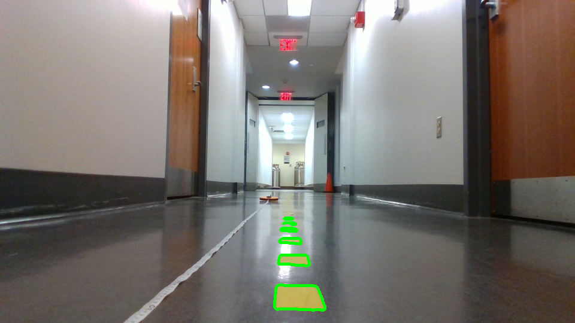
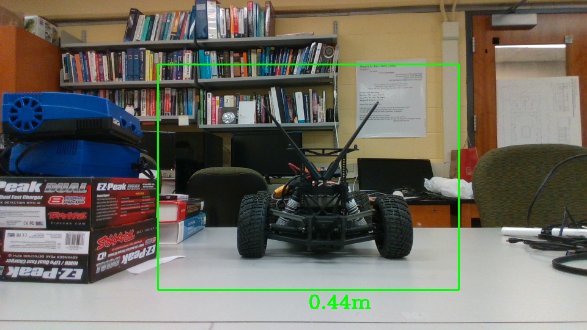
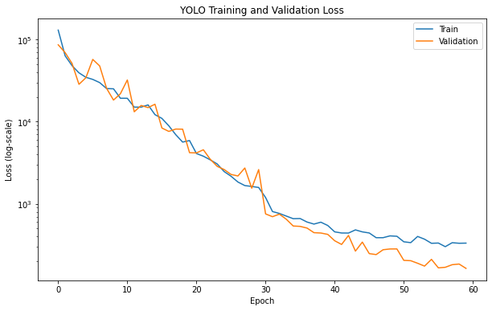

# Lab 8: Vision Lab

## The x, y distance of the unknown cones?
(0.6, 0.125)

## Lane Detection Result Image


## Integrated Object Detection + Distance Calculation Result Image


## Nerual Network Training & Testing Loss Plot


## Is FP16 faster? Why?
Yes, FP16 is faster because it is half-precision floating point which means it reqeuires less memory footprint and less computational resources for numeric calculations.

## Pipeline Instructions
Use command below to run pipeline on camera stream on vehicle

```python3 run_detection.py```
